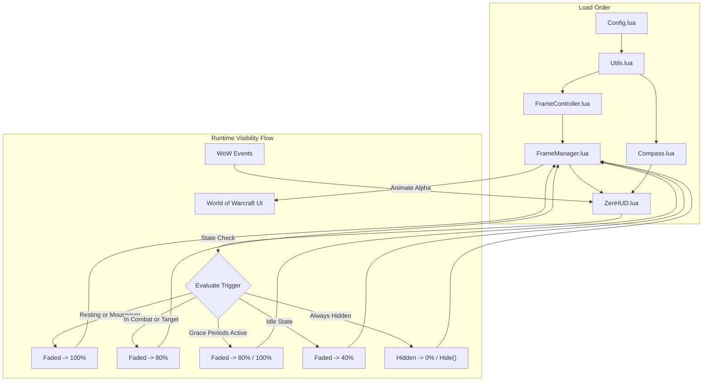

# ZenHUD — Immersion UI

A minimal, intelligent UI addon designed to make the World of Warcraft interface feel cleaner, smarter, and more immersive. Developed with a philosophy of *"invisible until needed"*, ZenHUD dynamically hides cluttered UI elements and brings them back only when they matter. 

This addon is built specifically for **World of Warcraft 3.3.5a (WotLK)** and is fully compatible with both the default Blizzard UI and **DragonFlight UI: Reforged (DFRL)**.

---

  
  
  
  

---

## 🌟 Core Philosophy

> **Problem**: Standard MMORPG user interfaces clutter your screen with action bars, player panels, and chat logs during normal exploration, drawing your attention away from the beautiful world you're in.
>
> **Solution**: ZenHUD serves as an intelligent, event-driven display driver. It hides or fades standard "always on screen" UI elements to let you fully appreciate the world. The UI appears when you need it (combat, targeting, resting, mouse-over) and smoothly fades away when you don't.

---

## 🧭 The Two-Tier Visibility Model

ZenHUD splits your interface frames into two distinct tiers to balance raw immersion with instant accessibility:

| Category | Managed Frames | Idle State | Combat / Target State | Mouseover / Resting State |
| :--- | :--- | :---: | :---: | :---: |
| **Hidden** | Minimap, PlayerFrame, TargetFrame, Quest Tracker, Vehicle Seat Indicator, Social & Emote Menu Buttons | **0%** (Hidden) | **0%** (Hidden) | **0%** (Hidden) |
| **Faded** | Action Bars, Pet Bar, Stance Bar, Buff & Debuff Frames, Experience/Reputation Bars, Micro Menu, Bags | **40%** | **80%** | **100%** |
| **Chat** | ChatFrame1-7 (including tabs, background, and dock buttons) | **0%** *(Toggleable)* | **0%** | **0%** |

> [!NOTE]
> Even when the **Chat** frames are faded to `0%`, the chat edit box remains fully functional. Opening your chat input (pressing `Enter`) or typing slash commands works seamlessly without manual toggles.

---

## ✨ Key Features

### 1. Smart Triggers & Visibilty Grace Periods
- **Zero-Latency Combat Reveal**: Instantly brings faded frames to **80%** alpha on entering combat.
- **Target Awareness**: Fades bars in to **80%** when selecting any valid living target.
- **Mouseover Hotspots**: Moving your cursor over hidden/faded bar areas dynamically reveals them to **100%** opacity for easy access.
- **Town & Inn Resting**: While resting in cities or inns, faded frames automatically stay at **100%** opacity so you can manage your inventory, spells, and quests easily without combat or mouseover triggers.
- **Debounced Grace Periods**: To prevent visual stutter, ZenHUD maintains visibility for:
  - **8 seconds** post-combat.
  - **2 seconds** after losing a target.
  - **2 seconds** after moving your mouse away from a hotspot.

### 2. Floating Navigation Compass
With the minimap completely hidden, how do you find your way? 
- ZenHUD adds a minimal, floating compass widget to your screen.
- Displays current heading degrees and cardinal directions (N, NE, E, SE, etc.).
- Highlighted **Gold indicator** for North.
- Fully draggable anywhere on your screen.
- Position is saved **per character**.

### 3. DragonFlight UI: Reforged (DFRL) Detection
ZenHUD automatically detects if you are running the popular **DragonFlight UI: Reforged** interface replacement. It hooks and fades the modern DFRL action bars, unit frames, and buff layout natively without requiring manually inputted frame names.

---

## 🛠️ Installation

1. **Download** the latest release from the [Releases Page](https://github.com/Zendevve/ZenHUD/releases).
2. **Extract** the zip folder into your World of Warcraft AddOns directory:
   `World of Warcraft/Interface/AddOns/ZenHUD/`
3. Make sure the folder is named exactly `ZenHUD` (and not `ZenHUD-master` or similar).
4. Restart your game or reload your interface (`/reload`).

---

## 💬 Slash Commands

By default, the addon is loaded but **disabled** to prevent sudden UI changes until you are ready. Use the slash commands below to configure it:

| Command | Action |
| :--- | :--- |
| `/imui on` | Enable immersion mode (Hides/fades UI, displays compass) |
| `/imui off` | Disable immersion mode (Restores default Blizzard UI visibility) |
| `/imui showcompass` | Enable the floating compass |
| `/imui hidecompass` | Disable/hide the compass |
| `/imui showchat` | Force chat window to be visible |
| `/imui hidechat` | Keep chat window faded to 0% |
| `/imui status` | Display current state parameters (combat status, resting status, target, etc.) |
| `/imui debug` | Toggle developer debug messages |

---

## 🏗️ Architecture

ZenHUD is written using a clean, decoupled modular structure designed to minimize CPU footprint on the client:

- **Config.lua**: Holds all default settings. Saves/reads settings per-character via `ZenHUDCharDB`.
- **Utils.lua**: Light frame-based timer and logging helper.
- **FrameController.lua**: Performs high-performance alpha transition animations with smooth interruption handling.
- **FrameManager.lua**: Translates Blizzard and DFRL frame lists into their respective hidden/faded groups. Periodically enforces alphas to override internal WoW resets.
- **Compass.lua**: Renders the floating cardinal compass frame, updating at 20 FPS when visible.
- **ZenHUD.lua**: Orchestrates event listeners (combat, target, resting, zone updates), evaluates states, and exposes slash commands.

---

## 📄 License

This project is licensed under the MIT License. See [LICENSE](LICENSE) for details.
